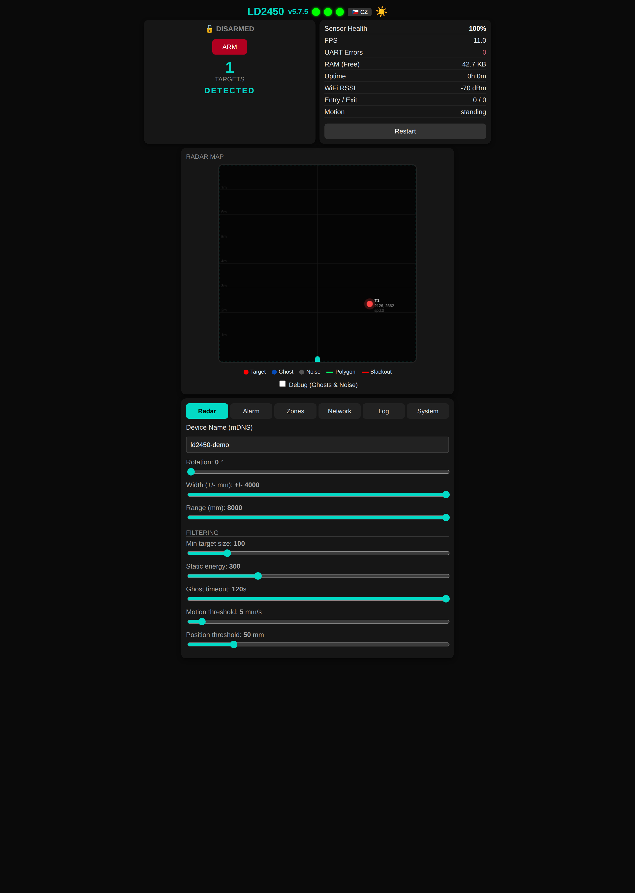
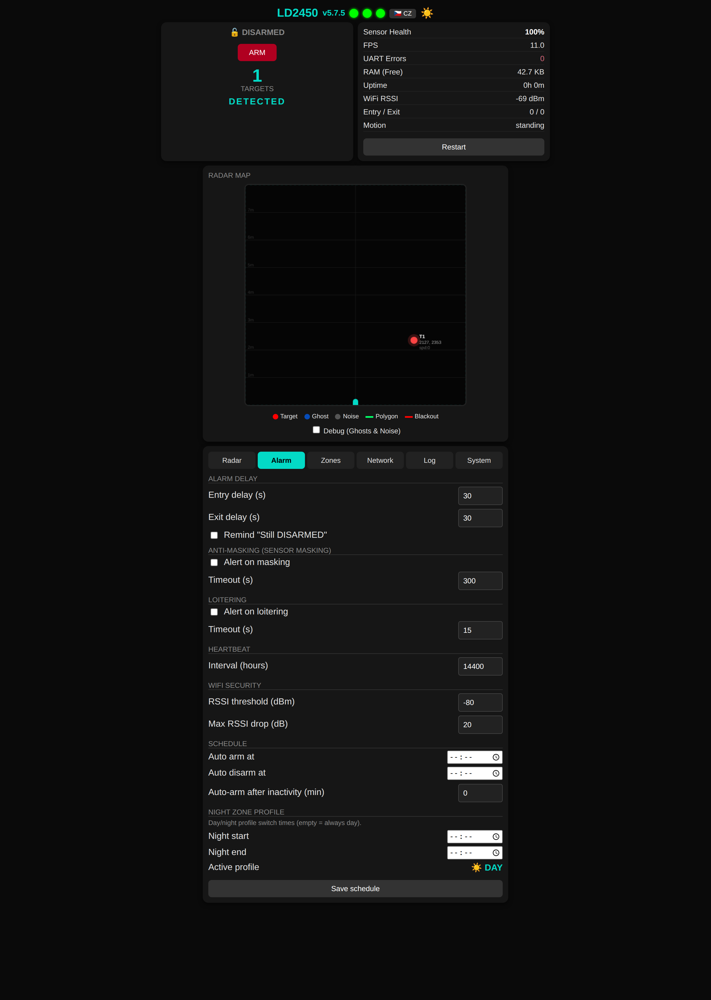
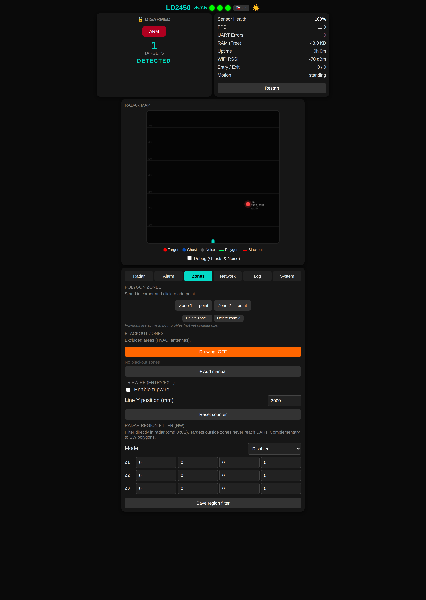
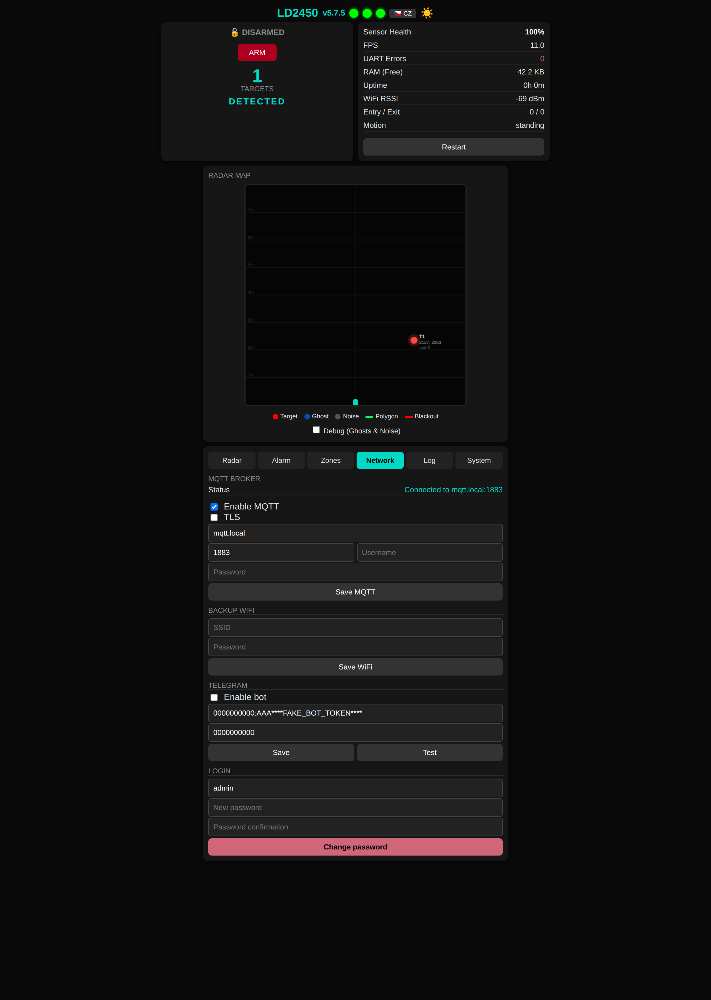
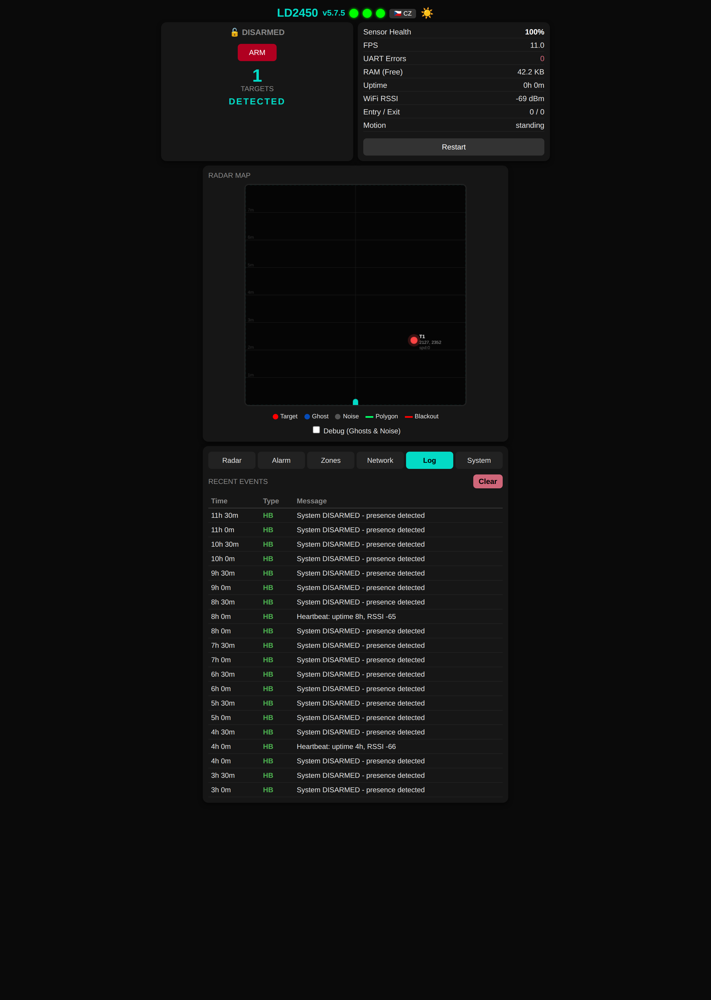
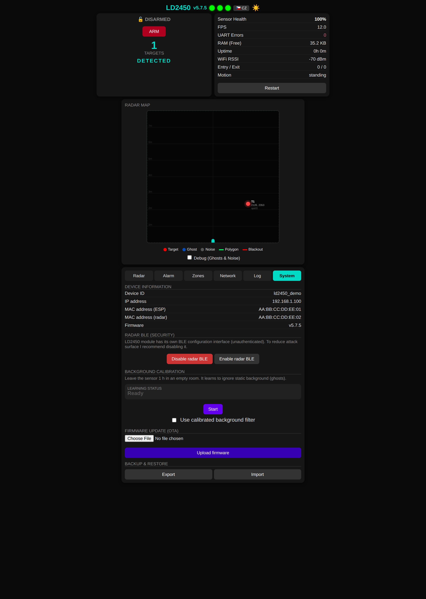

# :shield: LD2450 Security :radar:

[](https://platformio.org/)
[](https://www.espressif.com/)
[](LICENSE)
[]()

**Multi-target intrusion detection system** built on ESP32 + HLK-LD2450 24 GHz mmWave radar. Real-time 2D target tracking with Kalman filtering, polygon detection zones, ghost suppression via background calibration, full alarm state machine, Home Assistant integration, Telegram bot, and a dark-mode bilingual (CS/EN) web dashboard with live radar map. No cloud required.

> [!TIP]
> **New in v5.7** -- Native hardware region filter (radar-side cmd 0xC2), day/night zone profiles with per-zone activity masks, bilingual web UI (CS/EN), regression test suite for the radar parser (16 unit tests), and a refactored route layer for cleaner endpoint code.

---

## Table of Contents

- [In 3 Points](#in-3-points)
- [Who Is This For](#who-is-this-for)
- [What You Need](#what-you-need)
- [Quick Start](#quick-start) (~10 min)
- [How It Works](#how-it-works)
- [Features](#features)
- [System Architecture](#system-architecture)
- [Web Dashboard](#web-dashboard)
- [Telegram Bot](#telegram-bot)
- [API Reference](#api-reference)
- [How to Update / Downgrade Sensor Firmware](#how-to-update--downgrade-sensor-firmware)
- [Known Issues & Limitations](#known-issues--limitations)
- [Roadmap](#roadmap)
- [FAQ](#faq)
- [Testing](#testing)
- [Real-World Deployment](#real-world-deployment)
- [Security & Privacy](#security--privacy)
- [Development History](#development-history)
- [Acknowledgments](#acknowledgments)
- [License](#license)
- [Contributing](#contributing)

---

## In 3 Points

1. **2D multi-target tracking, not just presence.** The LD2450 reports X/Y coordinates and speed for up to 3 simultaneous targets. This firmware turns that into a security system with polygon zones, approach trails, and a live radar map.
2. **AI ghost suppression.** mmWave radars see reflections from furniture, HVAC, and metal surfaces. A noise learning mode builds an 80x80 grid map of static reflectors and filters them out automatically.
3. **Battle-tested architecture.** Shares the alarm state machine, MQTT offline resilience, and security hardening from the [LD2412-security](https://github.com/PeterkoCZ91/HLK-LD2412-security) project. Running in production since 2025.

---

## Who Is This For

- **DIY security enthusiasts** who want multi-target tracking without cloud subscriptions
- **Home Assistant users** looking for a radar node with 2D coordinates, not just a binary presence sensor
- **LD2450 developers** who want a production-tested reference with Kalman filtering, ghost detection, and zone management
- **Multi-sensor builders** who want to pair this with [LD2412-security](https://github.com/PeterkoCZ91/HLK-LD2412-security) for layered detection

---

## What You Need

### Hardware

| Part | Description | ~Cost |
|------|-------------|-------|
| ESP32 DevKit | ESP32-WROOM-32 module | $3--6 |
| HLK-LD2450 | 24 GHz FMCW mmWave radar (UART, multi-target) | $5--8 |
| 5 V power supply | Stable supply for both ESP32 and radar | $2--3 |
| **Total** | | **~$12** |

Optional: piezo buzzer or relay for siren output (any GPIO).

### Software (All Free)

- [PlatformIO](https://platformio.org/) (VS Code extension or CLI)
- [Home Assistant](https://www.home-assistant.io/) (optional, for MQTT integration)
- [Telegram](https://telegram.org/) (optional, for mobile alerts)

### Required Skills

- Basic soldering (4 wires: VCC, GND, TX, RX)
- Editing a config file (WiFi password, MQTT server)
- Flashing an ESP32 via USB

---

## Quick Start

**~10 minutes from clone to working system.**

```bash
# 1. Clone
git clone https://github.com/PeterkoCZ91/HLK-LD2450-security.git
cd HLK-LD2450-security

# 2. Create your config files
cp include/secrets.h.example include/secrets.h
cp include/ld2450/known_devices.h.example include/ld2450/known_devices.h
# Edit secrets.h with your WiFi, MQTT, and Telegram credentials

# 3. Wire the sensor (see table below) and connect ESP32 via USB

# 4. Build and flash
pio run -e ld2450_lab --target upload

# 5. First boot: connect to the WiFi AP "esp32-ld2450-XXXX" (password from AP_PASS)
#    Configure your WiFi and MQTT in the captive portal
#    After reboot, open http://<device-ip>/ in your browser
```

### Wiring

| ESP32 | LD2450 | Signal |
|-------|--------|--------|
| GPIO 18 | TX | UART RX (radar data) |
| GPIO 19 | RX | UART TX (commands) |
| 5V | VCC | Power |
| GND | GND | Ground |

> UART baud rate: 256000, 8N1, Serial2. For ESP32-C6, use the same pins -- native USB is on a separate interface.

---

## How It Works

The LD2450 radar continuously scans a 120-degree field at 24 GHz, reporting X/Y coordinates and speed for up to 3 targets simultaneously at ~10 Hz. The ESP32 reads these frames over UART and runs them through a multi-stage processing pipeline.

```
  LD2450 Radar            ESP32 Processing Pipeline             Outputs
 +------------+     +-----------------------------------+    +-----------+
 |  24 GHz    | UART|  Frame Parser (3 targets/frame)   |    |  MQTT/HA  |
 |  FMCW      |---->|  Kalman Filter (EKF2D per target) |    |  Telegram |
 |  120 deg   |     |  Ghost Detector (noise map)       |--->|  Siren    |
 |  3 targets |     |  Zone Classifier (polygon/bbox)   |    |  Web UI   |
 |  ~10 Hz    |     |  Alarm State Machine              |    |  BLE      |
 +------------+     +-----------------------------------+    +-----------+
```

### Alarm State Machine

```
                    arm (with delay)
  DISARMED ──────────────────────> ARMING
      ^                              |
      |  disarm                      | exit delay expires
      |                              v
      +<─────── TRIGGERED <──── ARMED
                    ^               |
                    |               | target in zone
                    | entry delay   v
                    +────────── PENDING
```

States: **DISARMED** -> **ARMING** (exit delay) -> **ARMED** -> **PENDING** (entry delay) -> **TRIGGERED** -> auto-rearm or disarm.

---

## Features

### :lock: Security

| Feature | Description |
|---------|-------------|
| Alarm state machine | 5 states with configurable entry/exit delays |
| Polygon detection zones | Up to 5 user-defined polygon zones with up to 8 vertices each |
| Blackout zones | Up to 5 rectangular exclusion areas (HVAC, furniture, windows) |
| Day / night profiles | HH:MM switch times; each polygon and blackout zone carries a per-profile mask (day-only, night-only, or both) |
| Anti-masking | Detects sensor obstruction (prolonged zero targets when armed) |
| Loitering detection | Alert when target lingers beyond timeout |
| Entry / exit counter | Virtual tripwire line with directional in/out counting |
| RSSI anomaly detection | WiFi jamming alert with baseline tracking |
| Scheduled arm / disarm | Daily HH:MM auto-arm/disarm + auto-arm after inactivity timeout |
| Auto-rearm | Re-arms after trigger timeout (default 15 min) |
| Siren/strobe output | Optional GPIO for audible/visual alarm |
| Disarm reminder | Notification if system left disarmed |

### :dart: Tracking

| Feature | Description |
|---------|-------------|
| Multi-target tracking | Up to 3 simultaneous targets with X/Y/speed |
| Extended Kalman Filter | EKF2D per target for smooth trajectory estimation |
| Target association | Hungarian-algorithm-inspired matching across frames |
| Ghost detection | Static targets exceeding timeout classified as ghosts |
| Background calibration | 80x80 grid noise map learns static reflectors (~1 h calibration) |
| Hardware region filter | Native LD2450 cmd 0xC2: 3 rectangular zones in include/exclude mode, filtered radar-side before UART |
| Configurable filtering | Min target size, static energy threshold, motion/position thresholds |
| Live radar map | Real-time 2D visualization with trails, zones, and noise overlay |

### :satellite: Connectivity

| Feature | Description |
|---------|-------------|
| MQTT + Home Assistant | Auto-discovery, all entities created automatically |
| MQTTS (TLS) | Optional encrypted MQTT with certificate expiry monitoring |
| MQTT offline buffer | LittleFS-backed ring buffer (30 messages), survives reboot, auto-replay on reconnect |
| Telegram bot | 7 commands: arm, disarm, arm_now, status, mute, unmute, restart |
| BLE configuration | NimBLE peripheral for mobile setup (passkey-protected) |
| WiFi failover | Backup SSID with automatic reconnection |
| OTA updates | Web-based and ArduinoOTA firmware upload, optional MD5 hash check |
| Dead Man's Switch | Auto-restart if no MQTT publish in 60 min |

### :bar_chart: Diagnostics

| Feature | Description |
|---------|-------------|
| Radar health score | Composite 0--100% health metric |
| UART monitoring | Frame rate, error count tracking |
| Heap monitoring | Free/min with low-memory warnings |
| Event log | LittleFS-backed event history with web UI |
| Heartbeat | Periodic MQTT ping (configurable interval) |
| Certificate monitoring | TLS cert expiry warning via MQTT |

### :computer: Interface

| Feature | Description |
|---------|-------------|
| Web dashboard | Responsive dark/light UI with live radar map and SSE updates |
| Bilingual UI | Built-in Czech / English toggle, persisted in localStorage |
| REST API | Full config, telemetry, alarm, zone, schedule, and OTA endpoints |
| Config backup/restore | JSON export/import of all settings |
| mDNS | `http://hostname.local/` access |

---

## Web Dashboard

Dark-mode responsive web UI accessible at `http://<device-ip>/`.

| Radar / Dashboard | Alarm & Schedule | Zones & Region Filter |
|:---:|:---:|:---:|
|  |  |  |

| Network | Event Log | System / OTA |
|:---:|:---:|:---:|
|  |  |  |

**Tabs:**

- **Radar** -- detection width/range, rotation, filtering thresholds, hostname
- **Alarm** -- entry/exit delays, anti-masking, loitering, heartbeat, RSSI security, scheduled arm/disarm, day/night profile times
- **Zones** -- polygon zone editor (click-to-add), blackout zones with per-profile masks, virtual tripwire, hardware region filter (cmd 0xC2)
- **Network** -- MQTT, WiFi backup, Telegram, credentials
- **Log** -- event history with clear function
- **System** -- background calibration, OTA firmware upload, config backup/restore, BLE radio toggle

> The entire UI is embedded as a single PROGMEM string. No external files, no SD card. Switch between Czech and English via the language button next to the connection icons.

---

## Telegram Bot

Create a bot via [@BotFather](https://t.me/BotFather), add token and chat ID to `secrets.h`.

| Command | Description |
|---------|-------------|
| `/help` | Command list |
| `/arm` | Arm with exit delay |
| `/arm_now` | Arm immediately |
| `/disarm` | Disarm |
| `/status` | Alarm state, target count, IP, RSSI, uptime, heap |
| `/mute` | Mute notifications for 10 min |
| `/unmute` | Enable notifications |
| `/restart` | Restart ESP32 |

---

## API Reference

### Endpoints

| Endpoint | Method | Description |
|----------|--------|-------------|
| `/api/version` | GET | Firmware version string |
| `/api/telemetry` | GET | Targets (x, y, speed, type), zone config, noise state |
| `/api/diagnostics` | GET | MQTT, WiFi RSSI, uptime, heap, health score, frame rate |
| `/api/config` | POST | Update radar config (width, range, thresholds, rotation) |
| `/api/alarm/state` | GET | Alarm state, armed flag, delays |
| `/api/alarm/arm` | POST | Arm the system |
| `/api/alarm/disarm` | POST | Disarm the system |
| `/api/alarm/config` | POST | Entry/exit delays, disarm reminder |
| `/api/security/config` | GET/POST | Anti-masking, loitering, heartbeat, RSSI thresholds |
| `/api/events` | GET | Event log (JSON) |
| `/api/events/clear` | POST | Clear event log |
| `/api/blackout/add` | POST | Add blackout zone (optional `mask` for day/night) |
| `/api/blackout/delete` | POST | Delete blackout zone |
| `/api/blackout/update` | POST | Enable/disable blackout zone, change `mask` |
| `/api/polygon/add_current` | POST | Add current target position as polygon point |
| `/api/polygon/set` | POST | Set/clear polygon zone (optional `mask` for day/night) |
| `/api/polygon/mask` | POST | Update day/night mask of a polygon zone |
| `/api/zones/region_filter` | GET/POST | Hardware region filter (cmd 0xC2): mode + 3 rectangular zones |
| `/api/schedule` | GET/POST | Daily arm/disarm times, auto-arm minutes, day/night profile times |
| `/api/tripwire` | POST | Configure entry/exit virtual tripwire |
| `/api/noise/start` | POST | Start background calibration |
| `/api/noise/stop` | POST | Stop and save noise map |
| `/api/noise/toggle` | POST | Toggle background noise filter |
| `/api/noisemap` | GET | Raw noise map (binary, 80x80 uint16) |
| `/api/radar/bluetooth` | POST | Toggle LD2450 module BLE radio (security hardening) |
| `/api/ota` | POST | Web OTA firmware upload |
| `/api/config/export` | GET | Export config as JSON |
| `/api/config/import` | POST | Import config from JSON |
| `/api/mqtt/config` | POST | MQTT broker settings |
| `/api/wifi/config` | GET/POST | Backup WiFi config |
| `/api/telegram/config` | GET/POST | Telegram bot settings |
| `/api/telegram/test` | POST | Send test message |
| `/api/auth/config` | POST | Change web credentials |
| `/api/restart` | POST | Restart ESP32 |
| `/events` | SSE | Server-Sent Events stream (alarm state changes) |

### MQTT Topics

Prefix: `security/<device_id>/`

| Topic | Direction | Description |
|-------|-----------|-------------|
| `presence/state` | publish | IDLE / PRESENCE / HOLD |
| `presence/count` | publish | Number of active targets |
| `alarm/state` | publish | disarmed / arming / armed_away / pending / triggered |
| `alarm/command` | subscribe | arm / disarm / arm_now |
| `notification` | publish | System notifications (OTA, alerts, learning) |
| `diag/rssi` | publish | WiFi signal strength |
| `diag/health_score` | publish | Radar health 0--100 |
| `diag/heap_free` | publish | Free heap bytes |
| `availability` | publish | online / offline (LWT) |

---

## System Architecture

```
src/ld2450/
 +-- main_ld2450.cpp           Entry point, WiFi, OTA, service orchestration, day/night scheduler
 +-- services/
 |    +-- LD2450Service.cpp    Radar driver (UART task, 3-target extraction, region filter cmd 0xC2)
 |    +-- PresenceService.cpp  Presence logic, calibration, WiFi reconnect, profile-aware zone filter
 |    +-- SecurityMonitor.cpp  Alarm state machine, tamper detection, health, scheduled arm/disarm
 |    +-- MQTTService.cpp      HA auto-discovery, TLS, publish/subscribe
 |    +-- MQTTOfflineBuffer.cpp LittleFS ring buffer for offline MQTT messages
 |    +-- WebService.cpp       Auth, SSE, route registration
 |    +-- TelegramService.cpp  Bot polling + command handler
 |    +-- BluetoothService.cpp NimBLE peripheral for mobile config
 |    +-- ConfigManager.cpp    NVS persistence layer
 |    +-- EventLog.cpp         LittleFS event ring buffer
 +-- web/                       REST API endpoints split by topic
      +-- network_routes.cpp    MQTT, WiFi, Telegram, auth
      +-- security_routes.cpp   Alarm, anti-masking, loitering, PIN code
      +-- schedule_routes.cpp   Daily schedule, day/night profile, tripwire, polygons
      +-- system_routes.cpp     Restart, OTA, BLE toggle, calibration, config import/export
      +-- telemetry_routes.cpp  /api/telemetry, /api/diagnostics, /api/debug/radar
      +-- zone_routes.cpp       Blackout zones, region filter, polygon masks

include/ld2450/
 +-- constants.h               All timing, thresholds, pin defaults
 +-- types.h                   Data structures, enums, AppContext
 +-- web_interface.h           Embedded HTML/CSS/JS dashboard with CS/EN i18n
 +-- utils/
      +-- EKF2D.h              2D Extended Kalman Filter [x,y,vx,vy]
      +-- TargetAssociation.h  Cross-frame target matching (Hungarian-inspired)
      +-- ld2450_frame.h       Pure parsing helpers, shared with native unit tests

include/
 +-- secrets.h.example         Credential template
 +-- ld2450/known_devices.h.example  Multi-device MAC mapping template

test/
 +-- test_parser/test_parser.cpp  16 host-side unit tests for the radar parser
                                  (run with `pio test -e native`)
```

### Data Flow

```
  UART RX (~10 Hz, 3 targets per frame)
       |
  [LD2450Service] Frame parser -> target extraction [x, y, speed, resolution]
       |
  [PresenceService] Kalman filtering -> ghost detection -> noise map filtering
       |
  [SecurityMonitor] Zone classification -> alarm state machine -> event queue
       |
  [main_ld2450.cpp] Dispatches to:
       +-- MQTTService (HA auto-discovery, telemetry publish)
       +-- TelegramService (bot commands + alerts)
       +-- WebService (SSE real-time stream, REST API)
       +-- EventLog (LittleFS persistence)
       +-- BluetoothService (BLE config)
```

---

## How to Update / Downgrade Sensor Firmware

The LD2450 radar module has its own firmware, separate from the ESP32. You can change it using the **HLKRadarTool** Bluetooth app.

> [!WARNING]
> Firmware changes are at your own risk. There is no official rollback mechanism. Always note your current version before changing.

**Steps:**

1. **Install HLKRadarTool** -- [Android](https://play.google.com/store/apps/details?id=com.hlk.hlkradartool) / [iOS](https://apps.apple.com/app/hlkradartool/id6475738581)
2. **Power cycle** the LD2450 module (disconnect and reconnect 5V -- the BLE interface only activates for ~30 seconds after power-on)
3. **Connect** via Bluetooth in HLKRadarTool (device shows as `HLK-LD2450_XXXX`)
4. **Select firmware version** from the available list and flash
5. **Power cycle** the module again after flashing
6. **Verify** via the web dashboard or serial console at boot

**The HLKRadarTool app is also used for:**
- Viewing real-time target data
- Changing detection parameters
- Baud rate configuration

---

## Known Issues & Limitations

> [!WARNING]
> The LD2450 is a **multi-target** radar but reports at most 3 targets per frame. In crowded spaces, targets may swap IDs between frames. The Kalman filter and target association algorithm mitigate this, but rapid crossovers can still cause brief glitches.

<details>
<summary><strong>Hardware limitations</strong></summary>

- Maximum 3 simultaneous targets (hardware limit of LD2450)
- 120-degree detection cone -- blind spots on the sides
- Radar sees through drywall and thin partitions (can detect neighbors)


</details>

<details>
<summary><strong>Software limitations</strong></summary>

- Web UI is a PROGMEM string -- editing requires firmware rebuild
- No multi-sensor coordination yet (each node is independent)
- Background calibration requires ~1 hour in an empty room
- Blackout zones are rectangular only (polygons for detection zones only)
- Day/night profile applies only to blackout zones; polygon zones are active in both profiles

</details>

<details>
<summary><strong>Compared to LD2412-security</strong></summary>

| Aspect | LD2450 (this project) | [LD2412-security](https://github.com/PeterkoCZ91/HLK-LD2412-security) |
|--------|:---------------------|:------------------------------------------------------------------|
| Targets | 3 simultaneous with X/Y/speed | 1 with distance + energy |
| Detection | 2D polygon zones (5) + hardware region filter (3 rects) | 1D distance-based zones (16 zones) |
| Tracking | Kalman filter, trails, radar map | Approach tracker, direction inference |
| Ghost handling | Background calibration map (80x80 grid) | Static reflector learning |
| Day / night profiles | :white_check_mark: per-zone HH:MM masks | -- |
| Unit tests | 16 parser tests | 41 tests |
| MQTT offline buffer | :white_check_mark: LittleFS queue | LittleFS queue |
| BLE config | :white_check_mark: NimBLE | -- |
| Engineering mode | N/A (LD2450 has no gates) | Per-gate energy visualization |

The two projects share the same alarm state machine, security architecture, and web UI patterns. They are designed to complement each other in a multi-sensor deployment.

</details>

---

## Roadmap

| Feature | Status | Description |
|---------|--------|-------------|
| Multi-sensor fusion | :bulb: Planned | LD2450 + LD2412 + WiFi CSI cross-validation via MQTT |
| Camera PTZ tracking | :bulb: Planned | Steer PTZ camera to follow radar targets |
| Hardware region filter | :white_check_mark: Done | LD2450 cmd 0xC2: 3 rectangular zones, radar-side filtering (v5.7) |
| Day / night zone profiles | :white_check_mark: Done | Per-zone HH:MM masks for day-only, night-only, or both (v5.7) |
| Bilingual web UI | :white_check_mark: Done | Czech / English toggle, persisted in localStorage (v5.7) |
| Parser regression tests | :white_check_mark: Done | 16 host-side unit tests (`pio test -e native`) (v5.7) |
| Scheduled arm/disarm | :white_check_mark: Done | Time-based auto arm/disarm + inactivity auto-arm (v5.5) |
| MQTT offline buffer | :white_check_mark: Done | LittleFS ring buffer, 30 messages, survives reboot (v5.5) |
| Entry/exit counter | :white_check_mark: Done | Virtual tripwire line with directional counting (v5.5) |
| Movement classification | :white_check_mark: Done | Standing/walking/running per target (v5.5) |
| Zone dwell time | :white_check_mark: Done | Per-target time spent in polygon zones (v5.5) |
| Kalman filter tracking | :white_check_mark: Done | EKF2D per target (v5.4) |
| Blackout zone drawing | :white_check_mark: Done | Draw on radar map (v5.3) |
| Background calibration | :white_check_mark: Done | 80x80 noise map (v5.2) |
| Security audit port | :white_check_mark: Done | 13 fixes from LD2412 audit (v5.5) |

---

## FAQ

<details>
<summary><strong>Do I need Home Assistant?</strong></summary>

No. The system works fully standalone with the web dashboard and Telegram bot. Home Assistant adds remote control via MQTT and nice dashboards, but it's optional.

</details>

<details>
<summary><strong>What's the difference between LD2450 and LD2412?</strong></summary>

The **LD2412** reports 1 target with distance and energy levels across 14 detection gates. The **LD2450** reports up to 3 targets with 2D X/Y coordinates and speed, but no energy data. LD2450 is better for tracking *where* people are; LD2412 is better for *how much* activity there is. For best results, use both with the [sensor fusion](https://github.com/PeterkoCZ91/HLK-LD2412-security) system.

</details>

<details>
<summary><strong>How do I reduce false alarms?</strong></summary>

1. **AI noise learning** -- run the 1h calibration in an empty room to build a noise map
2. **Blackout zones** -- exclude known reflectors (HVAC, metal furniture, antennas)
3. **Min target size** -- increase to filter small reflections
4. **Ghost timeout** -- reduce to classify static objects faster
5. **Polygon zones** -- limit detection to specific areas only

</details>

<details>
<summary><strong>Can it detect through walls?</strong></summary>

Yes, 24 GHz radar penetrates drywall, wood, and thin partitions. Use blackout zones and polygon zones to limit the effective detection area.

</details>

<details>
<summary><strong>What happens when WiFi goes down?</strong></summary>

The alarm keeps running locally. Events are logged to flash. A Dead Man's Switch restarts the ESP32 if MQTT is unreachable for 60 minutes.

</details>

<details>
<summary><strong>How much does it cost?</strong></summary>

About $12 for a single node (ESP32 + LD2450 + power supply). No subscriptions, no cloud fees.

</details>

---

## Testing

```bash
# Build for lab (USB flash)
pio run -e ld2450_lab

# Flash via USB
pio run -e ld2450_lab --target upload

# Flash via OTA (change IP in platformio.ini first)
pio run -e ld2450_prod --target upload
```

### Build Environments

| Environment | Board | Upload | Use case |
|-------------|-------|--------|----------|
| `ld2450_lab` | ESP32-WROOM | USB | Development, debug |
| `ld2450_prod` | ESP32-WROOM | OTA | Production deployment |
| `native` | host | -- | Parser regression tests (`pio test -e native`) |

### Parser Unit Tests

```bash
pio test -e native
```

The `native` environment compiles the radar frame parser against Unity test framework and runs 16 host-side regression tests covering: valid CSRON frames (single/multi target), origin-target with non-zero resolution (HLK firmware v2.14), trailing garbage handling, header-byte-inside-payload anti-false-match, and back-to-back frame parsing. No ESP32 hardware needed.

### Multi-Device OTA

Each device identifies itself by MAC address using the `known_devices.h` lookup table:

```c
{ "aa:bb:cc:dd:ee:f1", "ld2450_living_room", "sensor-ld2450-living-room" },
{ "aa:bb:cc:dd:ee:f2", "ld2450_hallway",     "sensor-ld2450-hallway" },
```

---

## Real-World Deployment

Running in production since 2025 monitoring residential spaces with multiple LD2450 and LD2412 nodes.

### Hardware Tested

| Board | Chip | Notes |
|-------|------|-------|
| ESP32 DevKit (generic) | ESP32-WROOM-32 | Primary platform, reliable |

### Memory Profile

| Metric | Value |
|--------|-------|
| Free heap at boot | ~60 KB |
| Firmware size | ~1.4 MB |
| Noise map size | 12.5 KB (80x80 x uint16) |
| Web UI (PROGMEM) | ~44 KB |
| Codebase | ~6000 LOC |

---

## Security & Privacy

<details>
<summary><strong>Data handling</strong></summary>

- All data processed locally on the ESP32
- No telemetry, analytics, or data sent to third parties
- Radar coordinates stay on your network (MQTT to your broker only)
- Event log stored on device flash (LittleFS)

</details>

<details>
<summary><strong>Network exposure</strong></summary>

- Web UI on port 80 (HTTP) with username/password authentication
- Optional MQTTS (TLS on port 8883) with CA certificate validation
- BLE pairing requires a 6-digit passkey
- Default credentials (admin/admin) trigger a warning banner in the web UI

</details>

---

## Development History

Evolved from a simple presence detector into a full multi-target security system over 50+ versions.

| Phase | Versions | Focus |
|-------|----------|-------|
| Foundation | v1.x--v3.x | Basic presence, MQTT, web UI |
| Multi-target | v4.x | Target tracking, polygon zones, radar map |
| Intelligence | v5.0--v5.2 | Kalman filter, ghost detection, background calibration |
| Security hardening | v5.3--v5.5 | Blackout zones, BLE config, LD2412 audit port, ESP32-C6 |
| Refinement | v5.6--v5.7 | Hardware region filter, day/night profiles, bilingual UI, parser regression tests |

See [CHANGELOG.md](CHANGELOG.md) for detailed version history.

---

## Related Projects

- **[multi-sensor-fusion](https://github.com/PeterkoCZ91/multi-sensor-fusion)** -- Python service that fuses this node's MQTT output with LD2412 1D radar, WiFi CSI (ESPectre), and Home Assistant sensors into a single weighted-average presence confidence per room. Ships with data-driven weight tuning tools.
- **[HLK-LD2412-security](https://github.com/PeterkoCZ91/HLK-LD2412-security)** -- Sister project using the 1D LD2412 radar; same alarm architecture, different physics sensor.
- **[HLK-LD2412-POE-security](https://github.com/PeterkoCZ91/HLK-LD2412-POE-security)** -- Ethernet (PoE) variant of the LD2412 node.
- **[HLK-LD2412-POE-WiFi-CSI-security](https://github.com/PeterkoCZ91/HLK-LD2412-POE-WiFi-CSI-security)** -- PoE LD2412 combined with WiFi CSI passive motion detection.

---

## Acknowledgments

- [HLK-LD2450](https://www.hlktech.net/) -- Hi-Link 24 GHz multi-target radar module
- [LD2412-security](https://github.com/PeterkoCZ91/HLK-LD2412-security) -- sister project, shared alarm architecture
- [ESPAsyncWebServer](https://github.com/mathieucarbou/ESPAsyncWebServer) -- async HTTP/SSE server
- [NimBLE-Arduino](https://github.com/h2zero/NimBLE-Arduino) -- lightweight BLE stack
- [ArduinoJson](https://github.com/bblanchon/ArduinoJson) -- JSON processing
- [PubSubClient](https://github.com/knolleary/pubsubclient) -- MQTT client

---

## License

MIT License. See [LICENSE](LICENSE) for details.

## Contributing

1. Fork the repository
2. Create a feature branch (`git checkout -b feature/my-feature`)
3. Test your changes
4. Open a pull request with a clear description

Bug reports and feature requests welcome via [GitHub Issues](../../issues).
